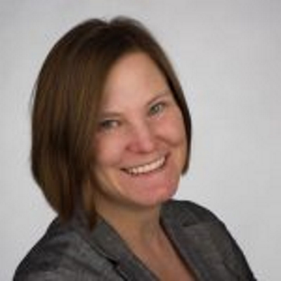
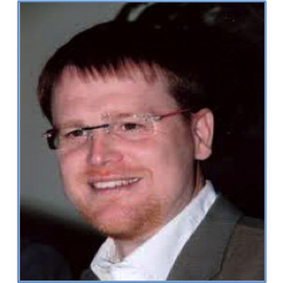
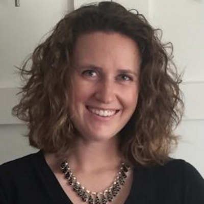
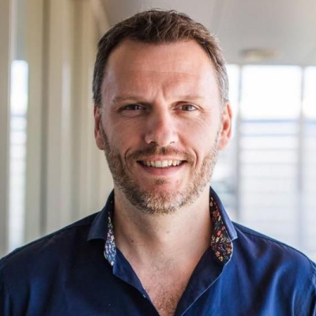
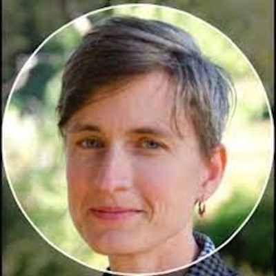



GSC Board
=========

The GSC Board was established in April 2009 to improve communication within the GSC, build GSC strategy, help move this community towards formalization (long-term sustainability, transparency and vision), improve community-level representation and help foster strategic partnerships with other communities. The Board has quarterly teleconferences and meetings in person at each GSC workshop.

In 2011 (at GSC 11), the Board ratified a set of ByLaws that define how the GSC is governed. A copy of the GSC Bylaws ratified by the Board on April 6, 2011 and amended on September 27, 2011 can be downloaded [here](./GSCBylaws_Latest.pdf).

[Current Board Members](#current-board-members)  
[Institutional Liasons to the GSC Board](#institutional-liasons-to-the-gsc-board)  
[Advisory Board Members](#advisory-board-members)  
[Former Board Members](#former-board-members)  
[GSC Board Committees](#gsc-board-committees)  
[GSC Committees and Working Groups](#gsc-committees-and-working-groups)

Current Board Members
---------------------
<table style="width:100%">
  <tr>
    <td></td>
    <td></td>
    <td></td>
  </tr>
  <tr>
    <td><a href="https://www.linkedin.com/in/lynn-schriml-1753609/" target=_blank>Lynn Schriml</a>, University of Maryland (2009-) Treasurer (2010–2015). President (2015–)</td>
    <td><a href="https://www.linkedin.com/in/bonnie-hurwitz-a1a1911/" target=_blank>Bonnie Hurwitz</a>, University of Arizona (2019-), Treasurer (2024-)</td>
    <td><a href="https://www.linkedin.com/in/chr1shunter/" target=_blank>Chris Hunter</a>, GigaScience Press (2018-), Secretary (2024-) </td>
</tr>
  <tr>
    <td></td>
	<td></td>
    <td></td>
  </tr>
  <tr>
    <td><a href="https://www.linkedin.com/in/folker-meyer-3849521b9/" target=_blank>Folker Meyer</a>, University of Duisburg-Essen (2009-). Treasurer (2015-2022)</td>
    <td></td>
    <td><a href="https://www.linkedin.com/in/scott-tighe-094058a/" target=_blank>Scott Tighe</a>, University of Vermont (2019–). Treasurer (2022-2024)</td>
  </tr>
  <tr>
    <td></td>
    <td></td>
    <td></td>
  </tr>
  <tr>
    <td><a href="https://www.linkedin.com/in/maria-chuvochina-4b9555124/" target=_blank>Maria Chuvochina</a>, Australian Centre for Ecogenomics (2019-)</td>
    <td><a href="https://www.linkedin.com/in/neiltahiti/" target=_blank>Neil Davies</a>, Berkeley (2011-)</td>
    <td><a href="https://www.linkedin.com/in/nikoskyrpides/" target=_blank>Nikos Kyrpides</a>, DOE JGI (2009-)</td>
  </tr>
  <tr>
    <td></td>
    <td></td>
    <td></td>
  </tr>
  <tr>
    <td><a href="https://www.linkedin.com/in/philip-hugenholtz-a91b784/" target=_blank>Philip Hugenholtz</a>, The University of Queensland (2015-)</td>
    <td><a href="https://www.linkedin.com/in/pier-luigi-buttigieg/" target=_blank>Pier Buttigieg</a>, MPI for Marine Microbiology, Bremen. (2020-)</td>
    <td><a href="https://www.linkedin.com/in/emiley-eloe-fadrosh-30670996/" target=_blank>Emiley Eloe-Fadrosh</a>, DOE JGI (2018-)</td>
  </tr>
  <tr>
    <td></td>
    <td></td>
    <td></td>
  </tr>
  <tr>
    <td><a href="https://www.linkedin.com/in/rob-finn-35a3562/" target=_blank>Rob Finn</a>, EMBL-EBI (2019-)</td>
    <td></td>
    <td><a href="https://www.linkedin.com/in/ilene-mizrachi-a7167717/" target=_blank>Ilene Mizrachi</a>, NCBI/GenBank. (2009-) Secretary (2019-2022)</td>
  </tr>
  <tr>
    <td></td>
    <td></td>
    <td></td>
  </tr>
  <tr>
    <td><a href="https://www.helmholtz-hzi.de/en/research/research-topics/bacterial-and-viral-pathogens/computational-biology-of-infection-research/alice-mchardy/" target=_blank>Alice McHardy</a>, Helmholtz Centre for Infection Research (2022-)</td>
    <td><a href="https://www.linkedin.com/in/scottjackson26/" target=_blank>Scott Jackson</a>, NIST (2022–)</td>
    <td><a href="https://www.linkedin.com/in/joao-carlos-setubal-2015734/" target=_blank>Joao Setubal</a>, University of São Paulo (2022-)</td>
  </tr> 
  <tr>
    <td></td>
    <td></td>
    <td></td>
  </tr>
  <tr>
    <td><a href="https://scienceandtechnology.jpl.nasa.gov/people/k_venkateswaran" target=_blank>Kasthuri Venkateswaran</a>, NASA-JPL</td>
    <td><a href="https://www.linkedin.com/in/ruth-e-timme-2615248/" target=_blank>Ruth Timme</a>, FDA</td>
    <td><a href="" target=_blank>TBC</a>, TBC</td>
  </tr>   
</table>

Advisory Board members
----------------------

Guy Cochrane, EMBL-EBI (May 2019-present)

Jack Gilbert (May 2015-present)

Owen White (May 2015-present)

Hans-Peter Klenk (May 2016-present)

Frank Oliver Glöckner (August 2017-present)

Tanja Woyke (May 2018-present)

Susanna Sansone (Sept 2022- present)

Ramona Walls, Critical Path Institute (Sept 2024- present)

Rita Colwell (Nov 2024 - present)

Former Board Members
--------------------
Ramona Walls, Critical Path Institute (2019-2024) Secretary (2022- Sept 2024)

Granger Sutton, J. Craig Venter Institute (2015- Sept 2024)

Linda Amaral-Zettler, MBL (April 2010-April 2020)

Guy Cochrane, EMBL-EBI (April 2009-May 2019)

Jim Cole, MSU (Sept 2010 -Sept 2019)

Peter Dawyndt, University of Ghent (April 2010 – May 2015)

Dawn Field, CEH (April 2009- September 2014)(Chair of GSC until September 2014)

George Garrity, MSU (April 2009-May 2019)

Jack Gilbert, Argonne (Jan 2010 – May 2015)

Lynette Hirschman, MITRE (April 2009 – May 2015)

Rob Knight, University of California San Diego (Sept 2011 -August 2019)

Renzo Kottmann, MPI-Bremen (July 2009-May 2015)

Norman Morrison, University of Manchester (Sept 2011 – April 2014)

Inigo San Gil, LNO (Sept 2010 – April 2014)

Peter Sterk, University of Oxford (April 2009 – May 2015)(Secretary of GSC until May 2015) (Advisory board 2015-2022)

Owen White, University of Maryland (April 2009 – April 2014)

John Wooley, UCSD (RCN4GSC PI)(Sept 2010 – April 2014)

Hans-Peter Klenk, Newcastle University (April 2010 – May 2016)

Robert Robbins, UCSD (April 2014 – May 2016)

Tatiana Tatusova, NCBI/RefSeq

Dave Ussery, Oak Ridge National Laboratory (April 2009-May 2017)

Frank Oliver Glöckner (April 2009-August 2017)

Pelin Yilmaz, MPI-Bremen (April 2013-) Secretary (May 2015 -2018)

Susanna Sansone</a>, University of Oxford (2009 - Sept 2022) (Advisory board 2022 - )

GSC Board Committees
--------------------

GSC Board Committees are defined the GSC Bylaws as being populated by GSC Board members.

**The RCN4GSC Board (Oct 2009-2014) – This Committee formed to provide oversight of the NSF funding to the GSC through the RCN4GSC award.**

John Wooley, UCSD (PI)  
Jim Cole  
Dawn Field  
Frank Oliver Gloeckner  
Inigo San Gil  
Lynn Schriml  
Owen White

**Finance (April 2010-2016) – This Committee formed to make recommendations about use of GSC funds and provides oversight of the GSC Treasurer.**

Frank Oliver Glöckner (Chair)  
Lynn Schriml (Treasurer)  
Guy Cochrane  
Peter Sterk  
George Garrity (MSU)  
Jack Gilbert (industry, sponsorship)  
Folker Meyer (industry, sponsorship)

**Governance and Bylaws (April 2010-2015) – This Committee formed to draft the GSC Bylaws.**

Lynn Schriml (Chair)  
Peter Sterk  
Dawn Field  
George Garrity  
Susanna Sansone

GSC Committees and Working Groups
---------------------------------

### Committees

GSC Committees are defined the GSC Bylaws as being populated by at least one GSC Board members and external members of the committee.

**Outreach (Oct 2010 -) – This Committee formed to develop strategies for disseminating information about the GSC and its activities into the wider community.**  
Susanna Sansone (Chair)  
Lynn Schriml  
Peter Sterk  
Jack Gilbert  
Dawn Field  
Lynette Hirschman

**Partnership with DigiBio (Technical) (April 2010-)**  
Renzo Kottmann  
Phillipe Rocca-Serra

**GSC Meetings (April 2011 -) – This Committee formed to deal with multiple proposals for future GSC workshops.**  
Proposals for future workshops must now be submitted in writing to the GSC Secretary for consideration by the GSC Board.  
Hans-Peter Klenk (Chair)  
Guy Cochrane  
George Garrity  
Lynn Schriml  
Peter Sterk

### Working Groups

Working groups in chronological order of establishment within the GSC:

**2005**

MIGS/MIMS – Subsumed 2010 into MIxS Compliance working group for maintenance of the checklists and compliance with the GSC family of minimum information standards

**2007**

GCDML – XML schema implementing MIxS  
EnvO-Lite – (Subsumed into the Environment Ontology)

**2008**

SIGS – Standards in Genomic Sciences journal – Founding Editors

**2009**

M5 – Metagenomics, Metadata, MetaAnalysis, Models and MetaInfrastructure  
Microbial Earth – sequencing all cultured type strains

**2010**

Biodiversity Working Group – linking molecular, genomic and biodiversity research  
Developer Group – building a new ecosystem of tools and data bases

**2011**

MIxS Compliance working group – maintaining MIxS and enabling adoption  
MIxS Compliance and Developer working groups merged into MIxS Compliance and Interoperability group

© 2020 [Genomic Standards Consortium](https://gensc.org/ "Genomic Standards Consortium")

