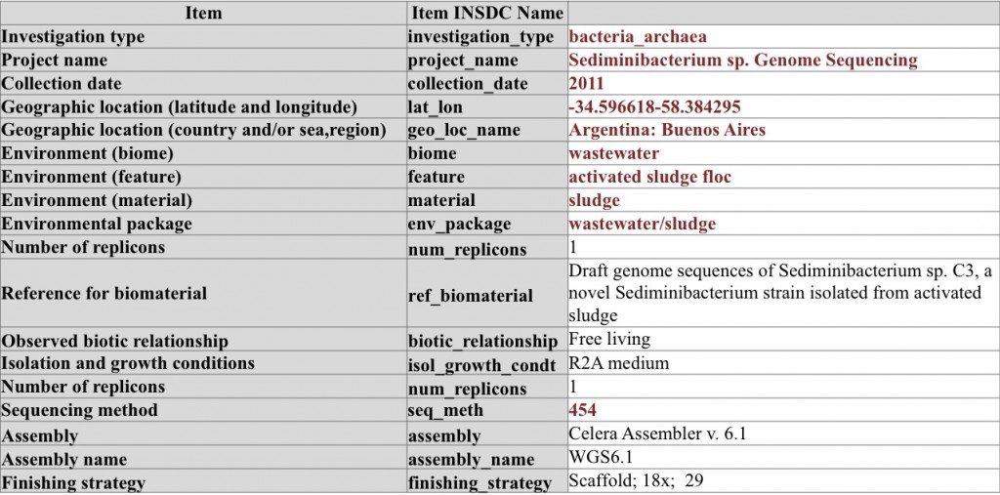
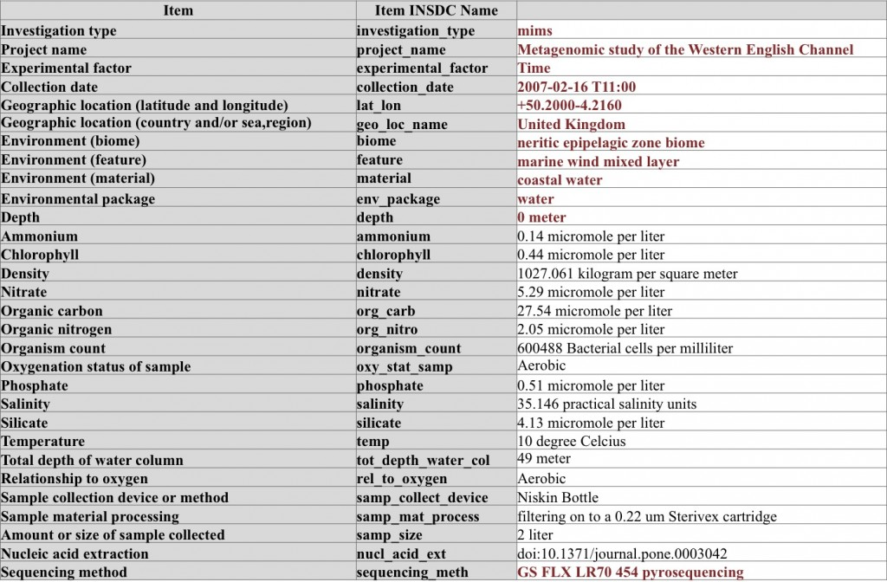
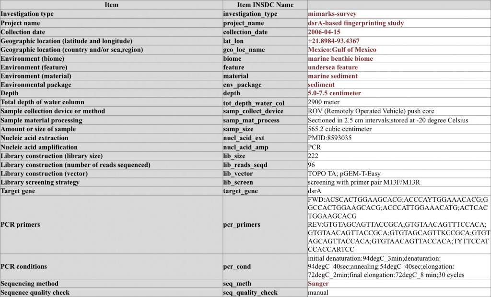



# Compliance 

Compliance with the core MIxS is very easy – it only consists of **11** metadata items, and can be filled in very quickly prior to sequence submission to public databases.

Below are examples of MIxS compliant metadata lists for a genome sequence, a metagenomic sample, and a marker gene survey. They have varying degree of detail, but ultimately what makes them MIxS-compliant are the common items marked in bold red font.

Genome sequencing of _Sediminibacterium_ sp. – note the use of conditional metadata items from the MIGS checklist

A metagenome (WGS) sequencing sample from sea water – here the sample is extensively characterized by using parameters from environmental package “water”

Marker gene survey on dsrA sequences and the accompanying MIMARKS-survey metadata – note the use of MIMARKS checklist conditional mandatory metadata items

