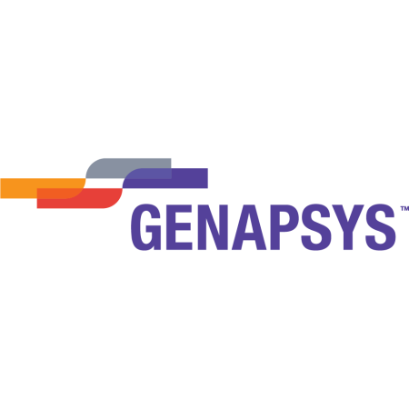
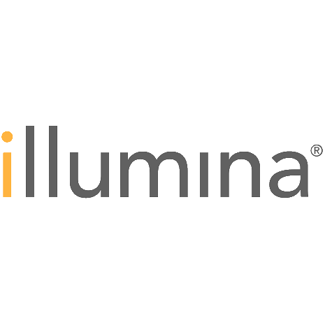
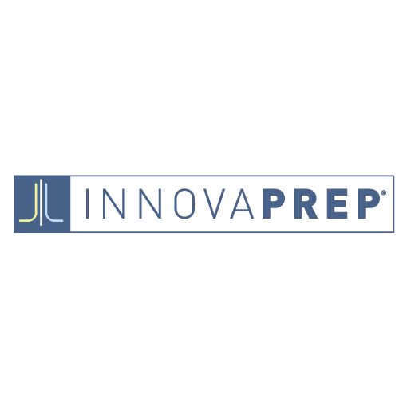
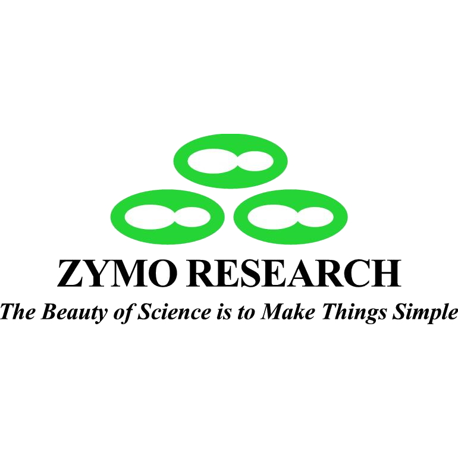
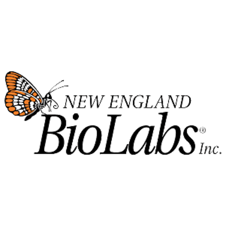
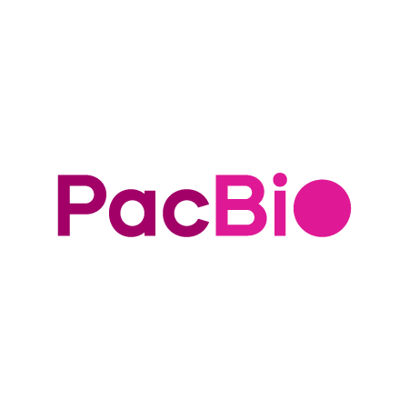
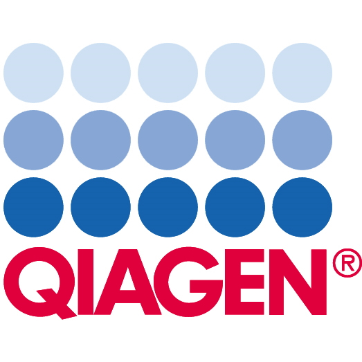
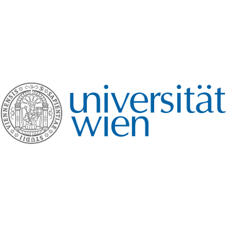
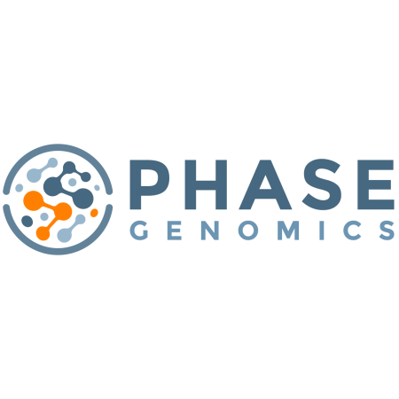
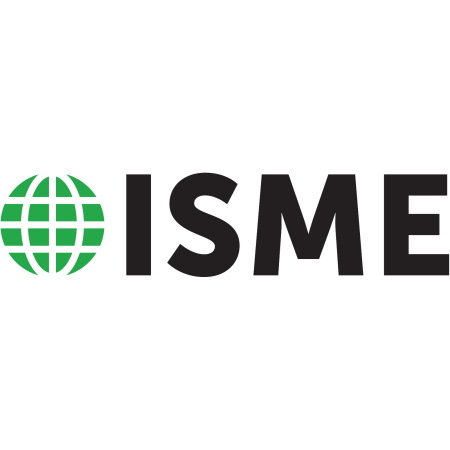



# Funding

While the vast majority of GSC efforts are contributed on a volunteer basis by a wide range of participants, the GSC gratefully acknowledges our generous sponsors for the GSC annual meetings.

The GSC also acknowledges a range of funding sources for its past meetings, including NERC (UK National Environment Research Council), NIeES (UK National Institute for Environmental eScience), NSF (US National Science Foundation), and the Gordon and Betty Moore Foundation (GBMF).
The GSC was launched in 2005 with funding from NIEeS and a NERC International Opportunities Award called “‘_Cataloguing our Complete Genome Collection_” [NE/3521773/1](http://gotw.nerc.ac.uk/list_full.asp?pcode=NE/D521773/1&cookieConsent=A) 2005-2008 and NERC granted further funding to build essential infrastructure [NE/D01252X/1](http://gotw.nerc.ac.uk/list_full.asp?pcode=NE/D01252X/1&cookieConsent=A). Funding from NSF in the form of a Research Co-ordination Network [RCN4GSC](https://pubmed.ncbi.nlm.nih.gov/21304642/) is further supporting knowledge exchange between GSC members and external communities, exchange visits of early career scientists to tackle GSC implementation projects, and helped launch the GSC’s Developer Group and the Biodiversity Working Group. The DOE has also now given funds to support the earliest stages of the development of the vision for the [M5](https://www.gensc.org/pages/projects/m5-project.html) project.

## GSC Sponsorship

The GSC has an annual sponsorship opportunities. There are three levels of sponsorship – Platinum, Gold and Silver, each with specific benefits for the sponsor. **Please [contact us](https://www.gensc.org/pages/contact.html) for more information.**

## Corportate Sponsors 
The GSC thanks and acknowledges the support of our corporate partners. 

**GSC22 (2022) Meeting Sponsors:**  
Pineapple Platinum Sponsors: [GenapSys](https://genapsys.com), [Illumina](https://www.illumina.com), [Innovaprep](https://www.innovaprep.com), [Zymo Research](https://www.zymoresearch.com)
GOLD Sponsors: [New England BioLabs](https://www.neb.com), [PacBio](https://www.pacb.com)
Silver Sponsor: [QIAGEN](https://www.qiagen.com/)

**GSC21 Meeting Sponsors:** 
GOLD Sponsors: [Universitat Wien - Computational Life Sciences](https://lifesciences.univie.ac.at/research/key-research-areas/computational-life-sciences/), [QIAGEN](https://www.qiagen.com/)
Titanium Sponsors: [PHASE Genomics](https://phasegenomics.com)
Bronze Sponsor: International Society for Microbial Ecology [ISME](https://www.isme-microbes.org) 

**GSC20 Meeting Sponsors**
Platinum Sponsor: [Zymo Research](https://www.zymoresearch.com)
Silver Sponsor: [Illumina](https://www.illumina.com)

## Prior Meeting Sponsorships
- 454 Life Sciences
- [(BGI)](https://www.bgi.com/global/home)
- [Biomatters](https://www.geneious.com/about/)
- CLCbio, [Digibio](https://digibio.org)
- [EdgeBio](https://www.edgebio.com)
- [Eppendorf](https://www.eppendorf.com/US-en/)
- LifeTechnologies, LuxBio.

## GSC Meeting Hosts
The GSC acknowledges the support of the following institutions and companies which have hosted and/or supported [GSC Meetings](https://www.gensc.org/pages/meetings.html) : 
 - NIeES at the University of Cambridge, UK (GSC1 and 3)
 - European Bioinformatics Institute, Hinxton, UK (GSC2, 4, 5, 6)
 - UCSD (GSC 7), DOE Joint Genome Institute (JGI) (GSC8, GSC17)
 - J. Craig Venter Institute (JCVI) (GSC9) 
 - Argonne National Laboratory (ANL) (GSC10)
 - Wellcome Trust Genome Campus, Hinxton UK (GSC11) 
 - Max Planck Institute Bremen, Germany (GSC12)
 - BGI Shenzen, China (GSC13), Oxford University (GSC14, GSC16)
 - National Institute of Health, (NIH), Bethesda, MD (GSC15)
 - Hellenic Center for Marine Research, Crete, Greece (GSC18)
 - University of Queensland, Australian Centre for Ecogenomics (GSC19)
 - University of California San Diego, Center for Microbiome Innovation (GSC20)
 - University of Vienna, Austria (GSC21)
 - Berkeley University's Gump Research Station and CRIOBE - Center for Insular Research and Observatory of the Environment, Moorea, French Polynesia (GSC22).  

