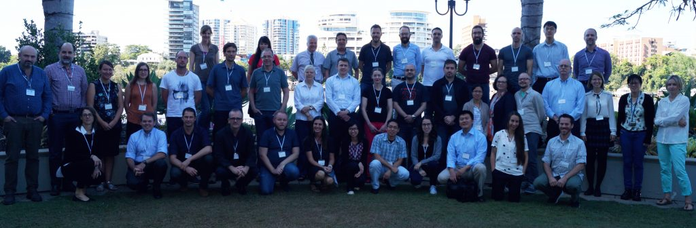



# Meetings

## **Upcoming meetings:**

*   [GSC22, Bangkok, Thailand, July 13-17, 2020](meetings/current.html)

## **Past meetings:**

*   [GSC21, Vienna, Austria, May 20-23, 2019](meetings/GSC21/GSC21.html)
*   [GSC20, San Diego, USA, May 2-4, 2018](meetings/GSC20/GSC20.html)
*   [GSC19, Brisbane, Australia, May 14-17, 2017](http://wiki.gensc.org/index.php?title=GSC_19)
*   [GSC18, Crete Hellenic Center for Marine Research, Crete, Greece, June 12-15, 2016](http://wiki.gensc.org/index.php?title=GSC_18)
*   [GSC 17, DOE JGI, Walnut Creek, CA, USA, May 4-6, 2015](http://wiki.gensc.org/index.php?title=GSC_17)
*   [GSC 16, Oxford, UK, March 31-April 2, 2014](http://wiki.gensc.org/index.php?title=GSC_16)
*   [GSC 15, National Institute of Health (NIH), Bethesda, MD, USA, April 22-24, 2013](http://wiki.gensc.org/index.php?title=GSC_Meetings#GSC_15.2C_National_Institute_of_Health_.28NIH.29.2C_Bethesda.2C_MD.2C_USA.2C_April_22-24.2C_2013)
    *   [GSC 15 follow up workshop: Genomic Observatories Network (GOs2), Smithsonian Institute, USA, April 25-26, 2013](http://wiki.gensc.org/index.php?title=GSC_Meetings#GSC_15_follow_on_workshop:_Genomic_Observatories_Network_.28GOs2.29.2C_Smithsonian_Institute.2C_USA.2C_April_25-26.2C_2013)
*   [GSC 14, Oxford, UK, September 18-20, 2012](http://wiki.gensc.org/index.php?title=GSC_Meetings#GSC_14.2C_Oxford.2C_UK.2C_September_18-20.2C_2012)
*   [GSC 13, BGI, Shenzhen, China, March 5-7, 2012](http://wiki.gensc.org/index.php?title=GSC_Meetings#GSC_13.2C_BGI.2C_Shenzhen.2C_China.2C_March_5-7.2C_2012)
*   [GSC 12, Max Planck Institute Bremen, Germany, September 28-30, 2011](http://wiki.gensc.org/index.php?title=GSC_Meetings#GSC_12.2C_Max_Planck_Institute_Bremen.2C_Germany.2C_September_28-30.2C_2011)
*   [GSC 11, Wellcome Trust Genome Campus, Hinxton, UK, April 4-6, 2011](http://wiki.gensc.org/index.php?title=GSC_Meetings#GSC_11.2C_Wellcome_Trust_Genome_Campus.2C_Hinxton.2C_Cambs.2C_UK.2C_April_4-6.2C_2011)
*   [GSC 10, Argonne National Laboratory, Argonne, IL, USA, October 4-6, 2010](http://wiki.gensc.org/index.php?title=GSC_Meetings#GSC_10.2C_Argonne_National_Laboratory.2C_Argonne.2C_IL.2C_USA.2C_October_4-6.2C_2010)
*   [GSC M5 Roundtable at the 13th International Society for Microbial Ecology Meeting in Seattle, WA, USA August 22-27, 2010](http://wiki.gensc.org/index.php?title=GSC_Meetings#GSC_M5_Roundtable_at_the_13th_International_Society_for_Microbial_Ecology_Meeting_in_Seattle.2C_WA.2C_USA_August_22-27.2C_2010)
*   [M3 & BioSharing SIG at ISMB 2010, Boston, MA, USA July 9-10, 2010](http://wiki.gensc.org/index.php?title=GSC_Meetings#M3_.26_BioSharing_SIG_at_ISMB_2010.2C_Boston.2C_Mass_USA_July_9-10.2C_2010)
*   [GSC 9, JCVI, Rockville, MD, USA, April 28-30, 2010](http://wiki.gensc.org/index.php?title=GSC_Meetings#GSC_9_JCVI.2C_Rockville_Maryland.2C_USA.2C_April_28-30.2C_2010)
*   [M3 Workshop at PSB, HI, USA, January 4, 2010](http://wiki.gensc.org/index.php?title=GSC_Meetings#PSB_.22M3.22_Workshop.2C_Jan_2010.2C_Hawaii)
*   [GSC 8, DOE JGI, Walnut Creek CA, USA, Sept 9-11, 2009](http://wiki.gensc.org/index.php?title=GSC_Meetings#GSC_8_DOE_JGI.2C_Sept_9-11.2C_2009.2C_Walnut_Creek_CA.2C_USA)
*   [M3 SIG at ISMB 2009, Stockholm, Sweden, June 29, 2009](http://wiki.gensc.org/index.php?title=GSC_Meetings#ISMB_SIG:_.22M3.22.2C_Stockholm_Sweden.2C_ISMB_2009)
*   [GSC 7, UCSD, San Diego, CA, USA, November 3, 2008](http://wiki.gensc.org/index.php?title=GSC_Meetings#GSC_7.2C_UCSD.2C_San_Diego.2C_CA.2C_USA)
*   [GSC 6, EBI, Hinxton, UK, October 15-17, 2008](http://wiki.gensc.org/index.php?title=GSC_Meetings#GSC_6.2C_EBI.2C_Hinxton.2C_UK)
    *   [Pre-workshop GCDML meeting](http://wiki.gensc.org/index.php?title=GSC_Meetings#Pre-workshop_GCDML_meeting)
*   [GSC 5, EBI, Hinxton, UK, December 12-14, 2007](http://wiki.gensc.org/index.php?title=GSC_Meetings#5th_GSC_Workshop)
*   [3rd EnvO (Environment Ontology) Workshop, University of Manchester, UK, March 13-15, 2008](http://wiki.gensc.org/index.php?title=GSC_Meetings#3rd_EnvO_.28Environment_Ontology.29_Workshop.2C_University_of_Manchester.2C_UK)
*   [2nd EnvO (Environment Ontology) Workshop, Cold Spring Harbor, NY, USA, November 15-16, 2007](http://wiki.gensc.org/index.php?title=GSC_Meetings#2nd_EnvO_.28Environment_Ontology.29_Workshop.2C_Cold_Spring_Harbor.2C_New_York.2C_USA)
*   [Genomics and Society: Today’s Answers, Tomorrow’s Questions, London, UK, October 25-26, 2007](http://wiki.gensc.org/index.php?title=GSC_Meetings#Genomics_and_Society:_Today.27s_Answers.2C_Tomorrow.27s_Questions)
*   [Inaugural EnvO (Environment Ontology) Workshop, Oxford, UK, August 29-31, 2007](http://wiki.gensc.org/index.php?title=GSC_Meetings#Inaugural_EnvO_.28Environment_Ontology.29_Workshop)
*   [GSC Birds of a Feather (BoF) meeting, ISMB 2007, Vienna, Austria, July 23, 2007](meetings/GSC-ISMB-BOF-2007/GSC-at-ismb-eccb-2007.html)
*   [GSC 4, Cambridge, UK, June 6-8, 2007](meetings/GSC4/GSC4.html)
*   [GSC 3, Cambridge, UK, September 11-13, 2006](meetings/GSC3/GSC3.html)
*   [1st Technical Implementation Working Group Workshop, Oxford, UK, December 18, 2005](http://wiki.gensc.org/index.php?title=GSC_Meetings#1st_Technical_Implementation_Working_Group_Workshop)
*   [GSC 2, EBI, Cambridge, UK, November 10-11, 2005](meetings/GSC2/GSC2.html)
*   [GSC 1, Cambridge, UK, September 7-9, 2005](meetings/GSC1/GSC1.html)
