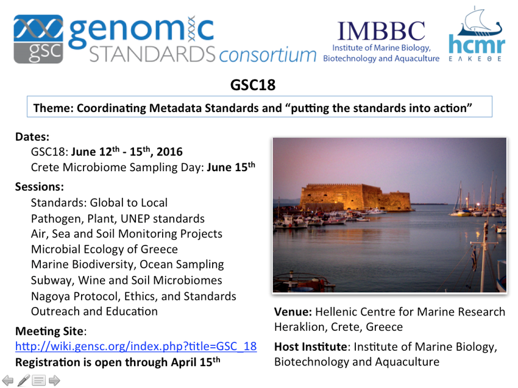
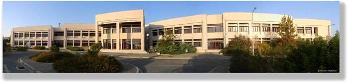



**The 18th Genomic Standards Consortium meeting**
=============================================
 
**Dates:** 12-15 June 2016 

**Location:** Crete Hellenic Center for Marine Research

**GSC Organizers:** Lynn Schriml, Georgios Kotoulas, Nikos Kyrpides, Frank-Oliver Gloeckner, Folker Meyer, Pelin Yilmaz

**Local Organizers:** Evangelos Pafilis, Melina Stavroulaki, Georgios Kotoulas, Antonios Magoulas

**Theme:** Coordinating Metadata Standards and “putting the standards into action”

GSC18 Talks are available via hyperlinks in the interactive [AGENDA](GSC18_agenda.pdf) 

**Satellite Workshop:** GSC-18 Sampling Day: [Crete Island Sampling Day](GSC18_ISD_HBIO2016_Poster.pdf) Please see the [GSC Island Sampling Day](GSC18_Island_Sampling_Day_v2.pdf) page for further details.

**GSC 18 Sessions**
GSC 18 will include 9 sessions. Each session will have a working group which would meet during the workshop and the chair of each session will summarise the conclusions of the working group during the workshop. Workshop participants are encouraged to sign their names on the sessions they are interested in participating in the GSC 18 Sessions Sign-Up sheet

**Session Topics**
* Standards: Global to Local
* Pathogen, Plant, UNEP standards
* Air, Sea and Soil Monitoring Projects
* Microbial Ecology of Greece
* Marine Biodiversity, Ocean Sampling
* Subway, Soil Microbiomes
* Nagoya Protocol, Ethics, and Standards
* Outreach and Education

**Keynote Speakers**
* Arianna Broggiato: The Nagoya Protocol: sampling and research in compliance with new legislations - what scientists have to do
* Sumir Panji: Standards Initiatives in H3ABioNet
* Phil Hugenholtz: Genomic Taxonomy, from Genus to Domain.
* Christos Ouzounis: Microbial Ecology in Greece and Bioinformatics
* Daniele Daffonchio: Ecology of microbial hydrocarbon degraders in the oceans

**Confirmed Speakers**
Pier Buttigieg, AWI, DE
Chelsea Carey, UCR, US
Simon Claus, VLIZ, BE
Guy Cochrane, EBI, UK
Jim Cole, MSU, US
Neil Davies, UCB, US
Danilo Ercolini, Uni Naples, IT
Antonio Fernandez-Guerra, MM-MPI, DE
Rob Finn, EBI, UK
Folker Meyer, ANL, US
George Garrity, SIGS, US
Panagiotis Gkorezis, UHASSELT, BE
Frank Oliver Glöckner, MM-MPI, DE
Phillip Goldstein, Uni Colorado, US
Pantelis Katharios, HCMR, GR
Wiebe Kooistra, SZN, IT
Georgios Kotoulas, HCMR, GR
Renzo Kottmann, MM-MPI, DE
Nikos Kyrpides, JGI, US
Manolis Ladoukakis, Uni Crete, GR
Manolis Mandalakis, HCMR, GR
Dimitra Manou, AUTH, GR
Ilene Mizrachi, NCBI, US
Claire Nedellec, INRA, FR
Nikolaos Nikolaidis, TUC, GR
Anastasis Oulas, HCMR, GR
Evangelos Pafilis, HCMR, GR - [presentation](presentations/session1-talk2-pafilis.pdf)
Donovan Parks, ACE, AU
Pavlos Pavlidis, ICS FORTH, GR
Lynn Schriml, UMB, US
Petra ten Hoopen, EBI, UK
Scott Tighe, Uni Vermont, US
Nicolas Tsesmetzis, Shell, UK
Georgios Tsiamis, Uni Patras, GR
Pelin Yilmaz, MM-MPI, DE

**Agenda**
The detailed GSC-18 agenda workshop can be found [here](GSC18_agenda.pdf)
A schedule overview is provided below:

## Day 1: June 12th, Sunday 
## Global to local: standards development and application, use cases and feedback

** 09:00 Meeting Kickoff: 
Local Host: Georgios Kotoulas, GSC President: [Lynn Schriml](presentations/session0-talk2-Lynn-GSC18_GSCboard_agenda.pdf)
** 09:30-11:00 Session 1:
Global and local view on standards
** 11:30-12:30 Round Table Discussion 1:
Role of Standards and Coordination across in Large Research Projects 
** 13:30-14:00 Keynote 1:
Arianna Broggiato - The Nagoya Protocol: sampling and research in compliance with new legislations - what scientists have to do 
** 14:00-15:30 Session 2:
Large Scale Genomics and Microbiome Initiatives  
** 16:30-17:30 Breakout Sessions: 
<ul>
<li>Computational Tools, data set harmonization and reproducibility </li>
<li>GSC Standards Working Session </li>
</ul>

## Day 2: June 13th, Monday
## Exploring standards across research initiatives

** 09:15-09:45 Keynote 2:
Sumir Panji: Standards Initiatives in H3ABioNet 
** 09:45-10:45 Session 3:
Exploring standards across research Initiatives 
** 11:15-12:30 Session 4:
Understanding Standards Needs Across Communities 
** 13:30-14:00 Keynote 3:
Phil Hugenholtz: Genomic taxonomy, from genus to domain. 
** 14:00-15:30 Session 5:
New standards and updates 
** 16:00-17:00 Session 6:
Application and Need for Standards 
** 17:00-17:30 Round Table Discussion 2:
Methods impacting Standards, Need for Standards 
** 17:30-18:15 Breakout Sessions:
<ul>
<li>MIxS Compliance and Interoperability Working Group (CIG)</li>
<li>NEON-CZ-metadata</li>
</ul>

## Day 3: June 14th, Tuesday
## Local Initiatives and Standards Uptake, GSC19 and Outreach

** 09:15-09:45 Keynote 4:
Christos Ouzounis: Microbial Ecology in Greece and Bioinformatics  
** 09:45-10:45 Session 7:
Greek Microbial Ecology  
** 11:15-12:30 Session 8:
Tara, NEON, Fish pathogens and Plant growth promoters     
** 13:30-14:00 Keynote 5:
Daniele Daffonchio  - Ecology of microbial hydrocarbon degraders 
in the oceans 
** Handoff to GSC-19: 
Down Under - April 2017 Brisbane, Australia 
** 15:00-16:00 Session 9:
Introduction to Crete Island Sampling Day - HCMR sampling training 

**Logistics**
**Venue**
The Institute of Marine Biology Biotechnolocy and Aquaculture (IMBBC) is based on the premises of the Hellenic Center for Marine Research in Crete, Greece. It located 200m from the sea, and 15km away from Heraklion’s “Kazantakis” Interanational Airport, right next to the CretAquarium.

For more information please view HCMR Area on Google maps.

**Registration**
To register online please visit the GSC18 registration web site.

The early registration fee is 350 USD (deadline: 15th April 2016),
the late registration fee is 500 USD.

Note: Registration will close on May 1st 2016

An early registration fee of 100 USD for local participants (Crete residents) applies
(deadline: 15th April 2016). The late registration fee (16th April to 1st May) for local participants is 350 USD.
Note: a discount code is required upon the registration of local participants,
please contact pafilis_at_hcmr.gr to this end.

**Accommodation**
A bulk booking has been made at the Astir Beach Hotel (1.6km/1mi away), please quote HCMRGSC18 for a price offer of 50 Euros/night (single room with breakfast) or 60 Euros/night (double room with breakfast) (map). The offer applies to bookings made by 15th April 2016. A direct link to the hotel's reservation form is available here. An offer of is also available.

Klio Apartments, Best Western 'Your Memories' Hotel, Kri Kri Village Holiday Apartments, and Golden Bay Hotel are also within walking distance from HCMR.

Map: All the above are shown in the HCMR Area, Hotels, Restaurants and Means of Transport Google Map

**Air Travel and Ground Transportation**
**Airports**
International Airport “Eleftherios Venizelos” (ATH)
Heraklion Airport “Nikos Kazantzakis” (HER)
information on direct flights to Heraklion Airport is available at: http://info.flightmapper.net/airport/HER
Chania Crete International airport “Ioannis Daskalogiannis” (CHQ) (RyanAir flights possible, NB: 165 km, away, it might be worth considering hiring a car, as public transport is not convenient. Cars can be booked online and picked-up at the airport.
To search for direct flights see: http://info.flightmapper.net/airport/CHQ
Google flights: please search using the previously mentioned three-letter airport codes: ATH, HER, CHQ

**Bus**
Long distance buses operate regularly (ie every 30 minutes to 1 hour) on the route between Heraklion and HCMR. A bus stop to HCMR is situated on the south-west side of the airport. For more information please see the HCMR Area, Hotels, Restaurants and Means of Transport Google Map and the bus timetable from Heraklion to Agios Nikolaos and back. The bus company web site is available here.

* Taxi from Heraklion Airport to HCMR
There are always many taxis at the airport. Alternatively, you can book a taxi online at http://www.taxi-crete.gr/book-taxi-crete (contact tel.: +30 6937 333 730). When making your booking, you must mention the phrase "ELKETHE - HCMR" (our research center) and your destination (e.g. Hotel Astir). This will get you a special discount fare of 25 euros from the airport to the ΗCMR or the Hotel (including taxes and airport & luggage charges). After filling in the online form, you should receive a confirmation e-mail within 2-10 hours, with all required information. All taxi-cars are Mercedes with English-speaking drivers.

* Taxi from HCMR to Heraklion Airport
A taxi stand is situated right outside HCMR. In addition to http://www.taxi-crete.gr (+30 6937 33 3730 ) described above, Mr Vangelis Kalikakis can also be contacted at (+30 6980 82 3019, +30 6945 68 1694) and a local taxi company +30 28970 41343. The waiting period in front of the HCMR main entrance is 10 to 15 minutes and rides to Heraklion can cost around 25 to 30 Euros.

**Internet Connection**
Wireless internet access is available at the congress venue. Please ask for a password at the registration desk/secretariat.

**Meals**
Meals and light snacks/coffee breaks will be provided on-site (HCMR and CretAquarium buildings). For other restaurants in the area please visit the: HCMR Area, Hotels, Restaurants and Means of Transport Google Map. A reception and a workshop dinner will be provided.

**Visa**
A complete listing of a countries requiring a visa is available at the Greek Ministry of Affairs. Standard visa requirements for visiting a Schengen (EU except UK) country apply. You may be exempt from the airport transit visa requirement, if you:

hold a valid or residence permit issued by a Schengen state;
hold a visa valid for a Member State of the European Union or the European Economic Area, Canada, Japan or the United States ;
hold a valid residence permit issued by a Member State of the European Union or the European Economic Area ;
hold a residence permit issued by the Principality of Andorra, Canada, Japan, Republic of San Marino, or the United States, that guarantees unrestricted right of return;
are a family member of a citizen of the EU, EEA or Switzerland ;
hold a diplomatic passport
For more information please please see the source web page: http://ec.europa.eu/dgs/home-affairs/what-we-do/policies/borders-and-visas/visa-policy/apply_for_a_visa/index_en.htm http://www.mfa.gr/en/visas/visas-for-foreigners-traveling-to-greece/ For visa invitation letter requests please contact pafilis at hcmr gr

**Currency and Credit Cards**
Euro is Greece's currency. Major credit cards are widely accepted. However, as smaller taverns or restaurants, taxi, buses may operate as cash-only, it is advisable that you have some Euros with you upon arrival.

June's 2015 cash withdrawal limit from ATMs applies to Greek bank account holders only. Greece's visitors can withdraw the regular amount of cash their banks allows them to when they are travelling abroad.