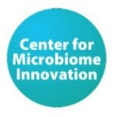
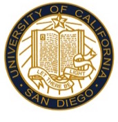
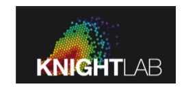
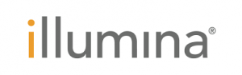
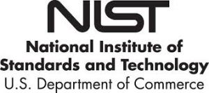



**20th Genomic Standards Consortium Meeting**
=============================================
 
**Dates:** May 2-4, 2018  
GSC board meeting May 1st, 2018

**Theme: Advances in Metabolome, Immunome & Taxonomy for Microbiome**  
GSC 20’s 3-day meeting will highlight the nexus of genomic standards, microbiomes and advances in metabolomics, immunome and taxonomy.

[AGENDA](GSC20Agenda.pdf) : daily agenda, speakers

May 1: 2:00 pm GSC Board Meeting

**May 2-4**: **GSC20 Annual Meeting**  
Doors open at 8:30 am.  
GSC20: 9:00 am – 5:00 pm.

[LOGISTICS](GSC20logistics.pdf): walking directions, maps, parking

**Venue:** Center for Microbiome Innovation, Atkinson Hall at University of California San Diego, USA  
**GSC Organizers:** Rob Knight, Lynn Schriml, Folker Meyer, Pelin Yilmaz, Jim Cole  
**Local Organizers:** Rob Knight, Sandrine Miller

**Registration** is open through **April 1st, 2018.**  
Registration Fee: **$400 USD (Students: $200 USD).**  
[GSC20 Registration Site](https://www.regonline.com/gsc20)

**GSC20 Keynotes**: Pieter Dorrestein (UCSD), Rita Colwell (University of Maryland), Michael Karin (UCSD)

**GSC20 Confirmed Speakers:**  
Andrew Allen (JCVI)  
Evan Bolton (NIH/NCBI/PubChem)  
Rodney Brister (NIH/NCBI Virus Group Leader)  
Guy Cochrane (EBI/ENA)  
Neil Davies (Berkeley Institute for Data Science, Genomic Observatories)  
John Deck (University of California Berkeley) Genomic Observatories)  
Nolwenn Dheilly (Stony Brook University, Parasite Microbiome Project)  
Kevin Dudley (Queensland University of Technology)  
Emiley Eloe-Fradrosh (JGI, Metagenomic Program)  
Idan Gabdank (Stanford, ENCODE)  
Bonnie Hurwitz (University of Arizona)  
Scott Jackson (NIST, IMMSA (International Microbiome and Metagenomics Standards Alliance)  
Laura Katz (Smith College)  
Brittany Needham (CalTech)  
Victor Nizet (University of California San Diego)  
Claire O’Donovan (EBI, Metabolomics Team Leader)  
Thomas Rattei (University of Vienna, Division of Computational Systems Biology)  
Julie Robinson (International Space Station, CASIS)  
Gary Siuzdak (Scripps Center for Metabolomics)  
Keng Cher Soh (Janssen)  
Shuiquan Tang (Zymo Research)  
Randi Vita (Immune Epitope Database, La Jolla Institute)  
Pelin Yilmaz (Max Planck Institute for Marine Microbiology)

**GSC20 Sponsors:**

**Platinum Sponsor**:

**Silver Sponsor**:

**Bronze Sponsor**:

**Logistics:**

The workshop will be held at Atkinson Hall on the La Jolla campus of University of California, San Diego. The address for campus is 9500 Gilman Driven, La Jolla, CA 92093. Buildings on campus do not have individual addresses, but if you use GoogleMaps and type in Atkinson Hall it will lead you directly to the building.

**Accommodation:**

We recommend GSC20 attendees reserving their rooms **before March 1st**. There are many hotels within a few miles of the venue.

*   [Estancia La Jolla](http://meritagecollection.com/estancialajolla/?_ga=2.176260134.2089325559.1500659918-864616354.1496177289):
*   [Sheraton La Jolla](http://www.sheratonlajolla.com):
*   [Hyatt Regency](https://lajolla.regency.hyatt.com/en/hotel/home.html) La Jolla at Aventine
*   [Residence Inn](http://www.marriott.com/hotels/travel/lajca-residence-inn-san-diego-la-jolla/) San Diego La Jolla
*   [Airbnb (La Jolla)](https://www.airbnb.com/s/La-Jolla--San-Diego--CA--United-States/homes?checkin=2018-04-30&checkout=2018-05-05&place_id=ChIJzQ7MT3bQ24ARlDAdXPQe5fw&allow_override%5B%5D=&room_types%5B%5D=Entire%20home%2Fapt&s_tag=50a_H5bV)

**Air Travel, Ground Transportation, and Visas**

VISA WAIVER COUNTRIES  
Citizens of countries participating in the Visa Waiver Program do not need to apply for visas to attend the Workshop. You may enter the United States using just your passports and your Workshop Registration Notice. At the port of entry into the U.S, please request to be given a “Visa Waiver for Business” (WB) status. That will allow you to stay in the U.S. for the length of the Conference.  
IMPORTANT: Effective January 12, 2009, all Visa Waiver travellers will be required to obtain an authorization via ESTA before traveling to the United States: [https://esta.cbp.dhs.gov/](https://esta.cbp.dhs.gov/).

The Visa Waiver countries are:  
Andorra, Australia, Austria, Belgium, Brunei, Czech Republic, Denmark, Estonia, Finland, France, Germany, Greece, Hungary, Iceland, Ireland, Italy, Japan, Latvia, Liechtenstein, Lithuania, Luxembourg, Malta, Monaco, Netherlands, New Zealand, Norway, Portugal, San Marino, Singapore, Slovakia, Slovenia, South Korea, Spain, Sweden, Switzerland, Taiwan and United Kingdom.

NON-VISA WAIVER COUNTRIES  
Citizens of countries not participating in the Visa Waiver Program will need to request a Business (B-1) visa at the nearest U.S. Consulate. Please present at the Consulate your Workshop Registration Notice, along with your valid passport. We urge you to do this EARLY, as there are often delays in this process. Official letters of invitation (without financial commitment) to help overcome administrative difficulties in some countries can be sent upon written request to the conference administrator.

CANADA  
Although Canada is not a Visa Waiver country, Canadian citizens do not need to apply for visas at the U.S. Consulate. Citizens of Canada may enter the country using just their passports, along with their Workshop Registration Notice. Please request at the port of entry status as a Visitor for Business (B-1).
