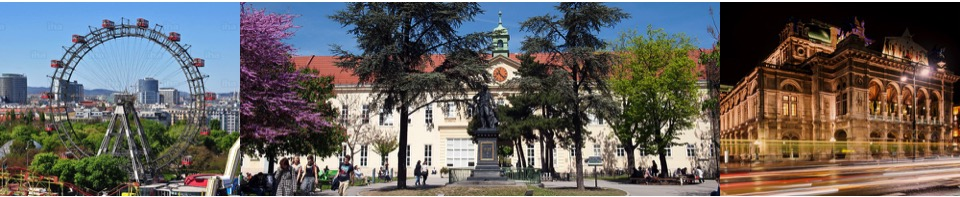
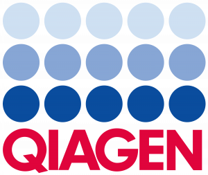
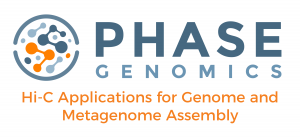



# 21st Genomic Standards Consortium Meeting

**Dates:** May 20-23, 2019  
GSC board meeting May 20, 2019

GSC 21st 3-day meeting will highlight the nexus of genomic standards and innovative methods in genomics. The meeting in charming Vienna will bring together people from many fields, including microbiology, microbial ecology, bioinformatics, medicine and system biology.

## LOGISTICS

**Venue:**  
Campus of the University of Vienna, Spitalgasse 2, 1090 Vienna \[[Google maps](https://goo.gl/maps/cAS3gbSZvQ92)\]

**Directions:** Public transport: subway lines U6 (Alser Strasse) or U2 (Schottentor) and tram lines 1, 5, 33, 43, 44 (Lange Gasse). Note: campus parking is very limited.

[GSC21\_Booklet\_Agenda](GSC21_Booklet_Agenda.pdf) 

[GSC21\_Maps\_locations](GSC21_Maps_locations.pdf)

[Vienna-Map-City-Center](Vienna-Map-City-Center.pdf)

[Vienna-tram-map](vienna-tram-map.pdf)

**Rooms:**

**May 20 – Room “Alte Kapelle”**  
GSC Compliance and Interoperability working group session  
GSC board meeting

**May 21-23 –** **Room “Aula”**  
Main GSC21 Meeting

## Themes:  
Sequence and function, species interactions, personal genomes/microbiomes, model communities, taxonomy, viruses, symbioses and holobiont genomes, unicellular eukaryotes, large microbial/viral pangenomes, and more …

**GSC21 Local Organizers:** Craig Herbold, Thomas Rattei

**GSC21 Organizers:** Lynn Schriml, Folker Meyer

### GSC21 Sponsors:

**GOLD Sponsor TITANIUM Sponsor BRONZE Sponsor**

   

**GSC21 Satellite Meetings**

**May 24, 2019:** **Cyanobacteria Nomenclature and Taxonomy [Satellite Meeting](http://gtdb.ecogenomic.org/gsc)**  
**Organizers:** Phil Hugenholtz, Rochelle Soo  
In this satellite meeting we will discuss the current issues of the nomenclature in the Cyanobacteria, propose a phylogenetic framework and try to determine nomenclature rules for populating the structure. The meeting will consist of speakers, a discussion and an annotation jamboree.

**May 23-24, 2019****:** **GOs/GLOMICON satellite meeting**  
The Global Omics Observatory Network (GLOMICON) – combining Microbial. Essential Ocean Variable (EOV) ontologies.

**Organizers:** Neil Davies, Pier Luigi Buttigieg, John Deck, Chris Meyer, Ramona Walls  
This satellite meeting will take place on afternoon of Thursday (23 May) and through Friday (noon or 5pm) 24 May. The agenda will address future directions of GOs Network and GLOMICON.

## AGENDA

### **May 20th**

**9:00 -13:00** GSC Compliance and Interoperability working group session  
(open meeting to all GSC21 attendees)

**13:00-17:00** GSC Board meeting (GSC Board members)

**16:00-18:00** Doors Open, GSC21

**18:00-18:45 Keynote:** Mining sequence data — GTDB taxonomy
Phil Hugenholtz – University of Queensland

**18:45-22:00** Welcome Reception

### **May 21st**

**9:00-10:30** GSC21 Day 1 Opening Session
**9:00-9:45**  
Welcome to GSC21 – University of Vienna  
Thomas Rattei and Craig Herbold – University of Vienna

The Genomic Standards Consortium : Expanding MIxS Genomic Minimal  
Information Standards and The National Microbiome Data Collaborative (NMDC)  
Lynn Schriml – President, Genomic Standards Consortium  
Institute for Genome Sciences, University of Maryland School of Medicine

**9:50-10:10**
Toward unrestricted use of public genomic data.  
Nikos Kyrpides – DOE Joint Genome Institute

**10:10-10:30** 
Evolving standards for 4D omic observation: The Global Omics Observatory Network and the Microbial Essential Ocean Variable  
Pier Buttigieg – MPI-Bremen

**10:30-11:15** Coffee break and Posters

**11:15** Qiagen – GSC21 Gold Sponsor
Insights from integrating Omics Data across Research Projects  
Frank Schacherer – VP Products and Solutions

**11:30-13:00** Towards Addressing The Reproducibility Crisis Session
Folker Meyer, Session Chair – Argonne National Laboratory

**11:30-11:50** “Reproducible Research: how Research Objects help”  
Carol Goble – Manchester, UK

**11:50-12:10** EBI’s use of CWL workflows  
Rob Finn – EMBL-EBI

**12:10-12:30** Discussion

**13:00 GSC21 Group Photo**

**13:15-14:30** Lunch

**14:30-16:30** Afternoon Workshops & Working Group Sessions

*   Benchmarking
*   Reproducibility
*   GOs : Genomic Observatories
*   GSCs role in developing MIGO – Minimum Information for Genomics Observatory

**16:30-17:00** Coffee and Posters

**17:00-18:00** University of Vienna historic main building tour

**18:00-18:45 Keynote:** Biobanking BBMRI-ERIC
Kurt Zatloukal – Medical University of Graz

### **May 22nd**

**9:00** Opening, GSC21 Day 2

**9:10-10:30** Standards and Bioinformatics For Emerging Fields Of Genomics Session
Nikos Kyrpides – Session Chair – DOE Joint Genome Institute  
Scott Tighe – Session Chair – University of Vermont

**9:10-9:30**  
Standards for Biosynthetic gene clusters  
Michelle Schorn – Wageningen University, Netherlands

**9:30-9:50**
GBOL – an ontology enforcing consistent genome annotation using ShEx definitions  
Jasper Jan Koehorst – Wageningen University, Netherlands

**9:50-10:10**
MIGO – Minimum Information for Genomics Observatory – role of GSC  
in developing these standards  
Neil Davies – Moorea, French Polynesia

**10:10-10:30** 
Characterizing Genomes of Rare and Novel Originals  
Scott Tighe – University of Vermont

**10:30-11:15** Coffee break

**11:15** Phase Genomics – GSC21 Titanum Sponsor
Ivan Liachko – CEO Phase Genomics

**11:30-13:00** Metabolomics – Genomics Session 
Claire O’Donovan – Session Chair – Head of Metabolomics, EMBL-EBI

**11:30-11:50**  
Integrating UniProt with the other ‘omics  
Maria Jesus Martin – Protein Function Development Team Leader, EMBL-EBI

**11:50-12:10**
The metabolomics use case for the Enzyme portal  
Keeva Cochrane – Metabolomics team, EMBL-EBI

**12:10-12:30**
The challenges facing the integration of metabolomics with the other omics and discussion  
Claire O’Donovan – Head of Metabolomics, EMBL-EBI

**12:30-12:50**
The Mosaic Challenge  
Scott Jackson – National Institute of Standards and Technology

**13:00-14:30** Lunch

**14:30-16:30** Afternoon Workshops & Working Group Sessions
Virus taxonomy and standards
Simon Roux – DOE Joint Genome Institute

**14:30 – 15:00** Longitudinal virome dynamics in infants
Jelle Matthijnssens – KU Leuven  

**15:00 – 15:30** The long and the short of it: Cryptic and abundant viral populations  
revealed by long-read metagenomics – Joanna Warwick – University of Exeter  

**15:30** Roundtable: Measures and criteria for the definition of taxonomic ranks  
(across all domains of life + viruses)

**Compliance and Interoperability Workshop**  
Ramona Walls – CyVerse

**18:00-18:45 Keynote** Is predicting function from meta-omics data possible?
Michael Wagner – University of Vienna

**GSC21 Conference Dinner**

### **May 23rd**

**9:00** Opening, GSC21 Day 3

**9:15-10:30** Standards In Medical Genomics Session
Christoph Bock – Session Chair  
Research Center for Molecular Medicine of the Austrian Academy of Sciences

**9:15-9:35** Christoph Bock

**9:35-9:55**  
Clinical Interpretation of Human Sequence Variants: Standard Guidelines vs Real World Practice  
Manop Pithukipakorn – Faculty of Medicine Siriraj Hospital

**10:00-11:00** Coffee break

**11:00-12:00** Functional Annotation – From Sequence to Function Session
Michael Wagner – Session Chair – University of Vienna

**11:00-11:20**  
Illuminating the functional dark side of genomics and metagenomics  
Antonio Fernandez – Max Planck Institute

**11:20-11:40**
Function without sequence – Cyanate and urea as substrates for marine Thaumarchaeota  
Katharina Kitzinger – University of Vienna

**12:00 GSC22 Hand Off**

**12:30** Close GSC21 – Lunch

## Registration is closed.

**Early registration open through April 1st.**  
Students $200 USD, Academia $400 USD, Industry $600

**Late registration** open April 2-19th.

**Hotels:** There are a number of hotels located in close proximity to the conference venue and are easily reachable by public transport.

[Hotel Bellevue](https://bellevuehotel.at/)
[Arthotel Ana Katharina Hotel](https://ana-hotels.com/katharina)
[Strudlhof Hotel](http://www.strudlhof.at/en/)
[Hotel Mania](https://hotelmania.net/hotel/vienna/checkvienna-liechtensteinstrase/)
[Hotel Atlanta](http://www.hotelatlanta.at/)
[Hotel Boltzmann](http://www.hotelboltzmann.at/)
