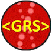
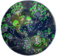
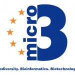
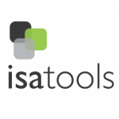



# Projects

**The GSC supports a wide range of projects. All are described below and the link under “GSC Project Description” leads to a page with relevant information about the project, including contacts, overview information, key links, and documents like publications and how to get involved. These project descriptions are based on the [GSC Project Description Template](projects/gsc-project-description-template.html) and are updated on an annual basis (Spring of each year). We welcome the addition of new projects at any time.**

 You can also view our standards using FAIRsharing [GSC collection](https://fairsharing.org/collection/GSC)

<table>
<thead>
<tr>
<th>Logo</th>
<th>Acronym</th>
<th>Full Name</th>
<th>Project Description</th>
<th>Lead</th>
<th>Kickoff Meeting, Start Date</th>
<th>Status</th> 
</tr>
</thead>
<tbody>
<tr>
<td></td>
<td style="text-align: center;vertical-align: middle">MIxS</td>
<td style="vertical-align: middle">Minimum Information about any Sequence</td>
<td style="vertical-align: middle"><a href="projects/mixs-gsc-project.html">Core standards of the GSC for describing genomes, metagenomes and gene marker sequences</a></td>
<td>Pelin Yilmaz</td>
<td>GSC 1, 2005</td>
<td>tbd</td>
</tr>
<tr>
<td></td>
<td style="text-align: center;vertical-align: middle">GCDML</td>
<td style="vertical-align: middle">Genomic Contextual Data Markup Language</td>
<td style="vertical-align: middle"><a href="projects/gcdml-project.html">An XML schema implementing MIxS</a></td>
<td>Renzo Kottmann</td>
<td>GSC 4, 2007</td>
<td>tbd</td>
</tr>
<tr>
<td></td>
<td style="text-align: center;vertical-align: middle">GRS</td>
<td style="vertical-align: middle">Genomic Rosetta Stone</td>
<td style="vertical-align: middle"><a href="projects/genomic-rosetta-stone.html">Mapping of genomic identifiers across databases (to help unify descriptions from different electronic sources)</a></td>
<td>Peter Dawyndt</td>
<td>GSC 4, 2007</td>
<td>tbd</td>
</tr>
<tr>
<td></td>
<td style="text-align: center;vertical-align: middle">SIGS</td>
<td style="vertical-align: middle">Standards in Genomic Sciences Journal</td>
<td style="vertical-align: middle"><a href="projects/standards-in-genomics-sigs-project.html">The Open Access Journal of the Genomic Standards Consortium (GSC)</a></td>
<td>George Garrity</td>
<td>GSC 5, 2008</td>
<td>tbd</td>
</tr>
<tr>
<td></td>
<td style="text-align: center;vertical-align: middle">M5</td>
<td style="vertical-align: middle">Metagenomics, Metadata, MetaAnalysis, Models and MetaInfrastructure</td>
<td style="vertical-align: middle"><a href="projects/m5-project.html">Bringing it all together in metagenomes &#8211; from data, to metadata to workflows to clouds</a></td>
<td>Folker Meyer</td>
<td>GSC 9, 2005</td>
<td>tbd</td>
</tr>
<tr>
<td></td>
<td style="text-align: center;vertical-align: middle">MEP</td>
<td style="vertical-align: middle">Microbial Earth Project</td>
<td style="vertical-align: middle"><a href="projects/microbial-earth-project.html">Megasequencing project covering all microbial type strains (~10.000 genomes)</a></td>
<td> Nikos Kyrpides</td>
<td>GSC 9, 2009</td>
<td>tbd</td>
</tr>
<tr>
<td> </td>
<td style="text-align: center;vertical-align: middle">GBWG</td>
<td style="vertical-align: middle">GSC Biodiversity Working Group</td>
<td style="vertical-align: middle"><a href="projects/gbwg-project.html">Building intersections between the genomics and biodiversity communities &#8211; towards building the field of &#8220;Biodiversity Genomics&#8221;</a></td>
<td>Bob Robbins</td>
<td>GSC 9, 2009</td>
<td>tbd</td>
</tr>
<tr>
<td></td>
<td style="text-align: center;vertical-align: middle">MIxS-ers</td>
<td style="vertical-align: middle">MIxS Compliance and Interoperability Working Group</td>
<td style="vertical-align: middle"><a href="projects/mixsers-project.html">The engine of the GSC &#8211; developers and curators working together to implement MIxS</a></td>
<td>James Cole</td>
<td>GSC 10, 2010</td>
<td>tbd</td>
</tr>
<tr>
<td> </td>
<td style="text-align: center;vertical-align: middle">Micro B3</td>
<td style="vertical-align: middle">Biodiversity, Bioinformatics and Biotechnology</td>
<td style="vertical-align: middle"><a href="projects/micro-b3-project.html">Marine Microbial Bioinformatics Platform development &#8211; generating and using GSC compliant data &#8211; including Ocean Sampling Day</a></td>
<td>Frank Oliver Glöckner</td>
<td>GSC 11, 2011</td>
<td>tbd</td>
</tr>
<tr>
<td></td>
<td style="text-align: center;vertical-align: middle">EnvO</td>
<td style="vertical-align: middle">Environment Ontology</td>
<td style="vertical-align: middle"><a href="projects/envo-project.html">An ontology to describe the environment (and samples taken from it)</a></td>
<td>Pier Luigi Buttigieg</td>
<td>GSC 14, 2012</td>
<td>tbd</td>
</tr>
<tr>
<td> </td>
<td style="text-align: center;vertical-align: middle">MIxS-BE</td>
<td style="vertical-align: middle">MIxS for indoor metagenomics</td>
<td style="vertical-align: middle"><a href="projects/mixs-be-project.html">A MIxS environmental package for describing the microbial community in built environments</a></td>
<td> Lynn Schriml</td>
<td>GSC 13, 2012</td>
<td>tbd</td>
</tr>
<tr>
<td> </td>
<td style="text-align: center;vertical-align: middle">BIOM</td>
<td style="vertical-align: middle">The Biological Observation Matrix (BIOM) format</td>
<td style="vertical-align: middle"><a href="projects/biom-project.html">A uniform file format for capturing the sample by observation matrix-style data and metadata that is common in the -omics fields.</a></td>
<td>Greg Caporaso</td>
<td>GSC 13, 2011</td>
<td>tbd</td>
</tr>
<tr>
<td></td>
<td style="text-align: center;vertical-align: middle">GOs Network</td>
<td style="vertical-align: middle">Genomic Observatories Network</td>
<td style="vertical-align: middle"><a href="projects/gos-network-project.html">Building a global network of expert site with long-term highly contextualized genomic observations</a></td>
<td>Neil Davies</td>
<td>GSC 14, 2012</td>
<td>tbd</td>
</tr>
<tr>
<td></td>
<td style="text-align: center;vertical-align: middle">Biocode Commons</td>
<td style="vertical-align: middle">Biocode Commons</td>
<td style="vertical-align: middle"><a href="projects/biocode-commons-project.html">Building the informatics stack for the Genomic Observatories Network &#8211; from field to analysis to publication</a></td>
<td>John Deck</td>
<td>GSC 14, 2012</td>
<td>tbd</td>
</tr>
<tr>
<td></td>
<td style="text-align: center;vertical-align: middle">MIGO</td>
<td style="vertical-align: middle">Minimum Information about a Genomic Observatory</td>
<td style="vertical-align: middle"><a href="projects/migo-project.html">A specification for describing Genomic Observatories</a></td>
<td>Neil Davies</td>
<td>GSC 12, 2011</td>
<td>tbd</td>
</tr>
<tr>
<td> </td>
<td style="text-align: center;vertical-align: middle">ISA</td>
<td style="vertical-align: middle">ISA Infrastructure</td>
<td style="vertical-align: middle"><a href="projects/isa-project.html">Next-generation data sharing software suite based on the ISA-file format &#8211; capable of handling multi-omic data.</a><a href="https://docs.google.com/file/d/0B1V2WmAsn-OkdG1rMUFVbl90M1E/edit?usp=drive_web&amp;pli=1">also available as a G-doc.</a></td>
<td>Susanna Sansone</td>
<td>2012 (2003)</td>
  <td>tbd</td>
</tr>
<tr>
<td> </td>
<td style="text-align: center;vertical-align: middle"> MIPS</td>
<td style="vertical-align: middle">Minimum Information on a Phenotype MicroArray Study</td>
<td style="vertical-align: middle"><a href="projects/mips-project.html">A minimum standard for recording and distributing PM data, which aid in improving genome annotation and testing metabolic hypotheses</a></td>
<td>Hans-Peter Klenk</td>
<td>GSC 15, 2013</td>
<td>tbd</td>
</tr>
<tr>
<td></td>
<td style="text-align: center;vertical-align: middle">MiBiG</td>
<td style="vertical-align: middle">Minimum Information about a Biosynthetic Gene cluster</td>
<td style="vertical-align: middle">

<a href="projects/mibig-project.html">Description of gene clusters encoding the biosynthesis of secondary metabolites.</a>

</td>
<td>Marnix Medema</td>
<td>GSC 15, 2013</td>
<td>tbd</td>
</tr>
<tr>
<td></td>
<td style="text-align: center;vertical-align: middle">GCDJ</td>
<td style="vertical-align: middle">Genomic Contextual Data JSON</td>
<td style="vertical-align: middle"><a href="projects/gcdj-project.html">A JSON exchange format for Genomic Contextual Data</a></td>
<td>Ivaylo Kostadinov</td>
<td>GSC 17, 2015</td>
<td>tbd</td>
</tr>
<tr>
<td></td>
<td style="text-align: center;vertical-align: middle">MIxS-HCR</td>
<td style="vertical-align: middle">MIxS for hydrocarbon resources</td>
<td style="vertical-align: middle"><a href="projects/mixs-hcr-project.html">A MIxS environmental package for describing the microbial community in hydrocarbon resources</a></td>
<td>Nicolas Tsesmetzis</td>
<td>GSC 17, 2015</td>
<td>tbd</td>
</tr>
<tr>
<td></td>
<td style="text-align: center;vertical-align: middle">GGBN Standard</td>
<td style="vertical-align: middle">GGBN Data Standard Specification</td>
<td style="vertical-align: middle"><a href="projects/ggbn-project.html">A set of terms and controlled vocabularies designed to represent tissue, DNA or RNA facts </a></td>
<td>Gabi Droege</td>
<td>GSC 18, 2016</td>
<td>tbd</td>
</tr>
</tbody>
</table>

End of table
