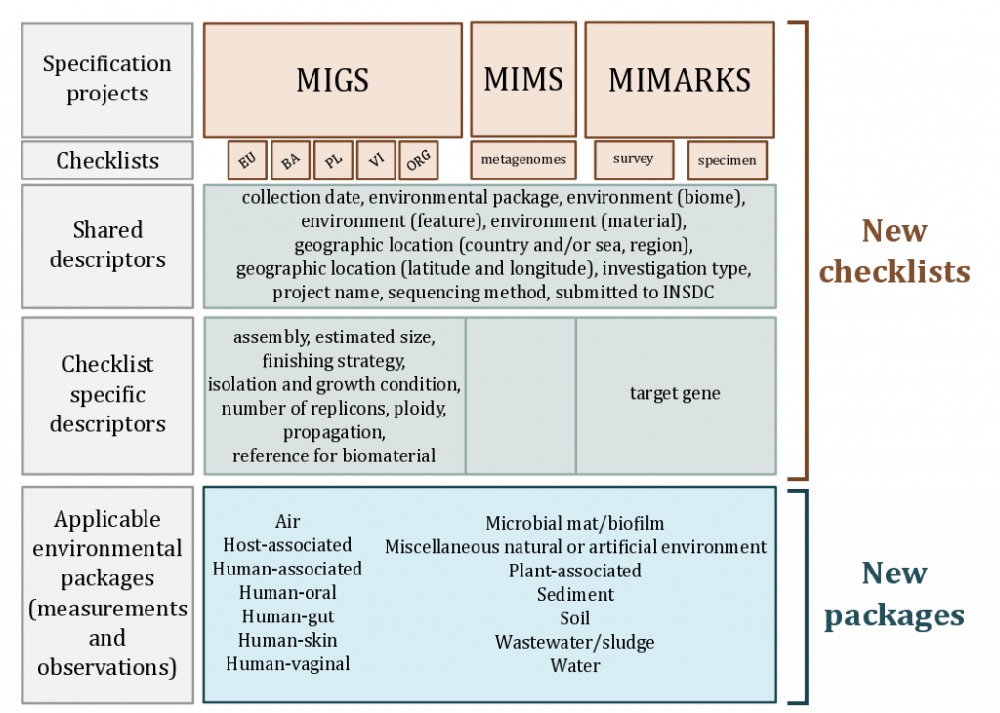
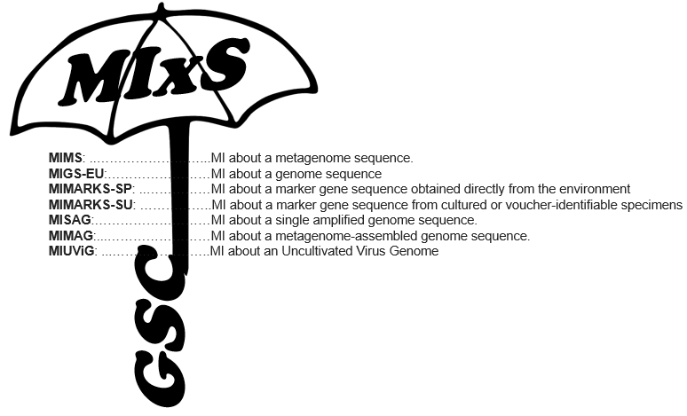


 
 
# Background 

The [first MIGS specification](https://doi.org/10.1038/nbt1360) enabled description of the complete range of possible genomes (eukaryotes, bacteria, archaea, plasmids, viruses, organelles) and metagenomes. With core descriptors to include information about the origins of the nucleic acid sequence (genome), its environment (latitude and longitude, date and time of sampling and habitat) and sequence processing (sequencing and assembly methods). Since then the GSC have expanded the family of checklists to not only allow a more comprehensive cataloging of metadata per sequence, but also to include sequence types that were not feasible at the time such as single cell sequencing (MISAG) and metagenome assembly sequences (MIMAG). 

This suite of checklists has become known as "MIxS" (Minimal Information About (X) Any Sequence, pronounced MIX-ess) standards introduced the reporting of a breadth of environment-specific metadata variables to augment the genome-specific checklists. Thus enabling the mix and matching of genome checklists and environmental-specific packages. 

The concept of the MIxS suite of standards has subsequently evolved to represent an overarching framework for checklists and environmental packages, creating a single entry point to all minimum information genome checklists from the GSC and to the environmental metadata extensions that together create environmental packages. 

MIxS includes the technology-specific checklists from the previous MIGS and MIMS standards, provides a way of introducing additional checklists such as MIMARKS, and also allows annotation of sample data using environmental packages. With this modular and extensible framework, both horizontal (i.e new environmental packages) and vertical extension (i.e. new checklists) development is possible and encouraged.

 
# Minimum Information about any Sequence (MIxS)

The current versions of the GSC family of minimum information standards (MIxS - Minimum Information about any (x) Sequence) are available below. 
The GSC have provided the information in sections to enable users to understand the relationships between the various levels of complexity, and provided a terminology section (below) to assist comprehension.

 
In addition, the GSC maintain a [GitHub repository](https://github.com/GenomicsStandardsConsortium/mixs) where the next versions are being developed and discussed, please feel free to join the discussion using the github issue tracker. The [GitHub Wiki](https://github.com/GenomicsStandardsConsortium/mixs/wiki) in that repository also contains some more techincal specifications. 

You can find all previous versions of the checklists in our [mixs-legacy GitHub](https://github.com/GenomicsStandardsConsortium/mixs-legacy) repository.

 **MIxS checklists** - Used to refer to the entire collection of all checklists under the MIxS umbrella.

## Terminology (GSC parlance):

## [Term](standards/all-terms.html)

A term is an individual metadata attribute used to describe any aspect of a sample, sequence, environment or methodology. This is the granular element of any checklist or extension.

Each term is uniquely defined and given its own URI. See the [terms page](standards/all-terms.html) for a complete searchable list of all terms defined within the GSC MIxS checklists and extensions.

## [Checklist](standards/checklists.html)

A checklist is a collection of metadata terms to minimally describe the sampling and sequencing method of a specimen used to generate a nucleotide sequence.

- See the [checklist page](standards/checklists.html) for more details on individual checklists.

## [Extension](standards/extensions.html) (previously known as Environmental package)

An extension is the collection of recommended metadata terms as developed by community experts, describing the specific context under which a sample was collected.

See the [extensions page](standards/extensions.html) for more details on available extensions.

## Combination (previously known as packages)
A combination of a Checklist with an Extension.

## Section
The grouping of a metadata term into a specific category. The current sections are;
	- **Investigation** ; terms that relate to the project and linking it to other electronic resources.
	- **Nucleic acid sequence source** ; terms that are about where and how the DNA sample was created.
	- **Sequencing** ; terms that relate to how the DNA sample was processed for sequencing.
	- **Environment** ; terms that relate to the environment from which the sample/DNA was obtained.

## MIXS ID
The resolvable globally unique persistent identifier associated with a Term, Extension, Checklist or Combination

There are also autogenerated read-the-docs pages for all Checklists, Extensions and Packages that can be [found here.](https://genomicsstandardsconsortium.github.io/mixs/)

## Core (a deprecated word)
The initial set of GSC metadata standards included a set of ten metadata terms that were required to be included in every checklist at that time, as these terms were considered to be vital for the reporting of metadata for any genome sequence. With the development of additional checklists the concept of 'core' evolved to be a list of terms recommended during the development of new checklists, and included terms which were Mandatory or Conditional Mandatory in ANY individual checklist. While this concept proved useful during the developmental phase of checklists before the implementation of the Link-ML model, we feel it is no longer adequately defined and henceforth will no longer be using this phrase.

## [Compliance and Implementation](standards/compliance.html)
Details of how to comply with the standard, and which repositories and institutions are currently making use of them (adopters).

## [Legacy](standards/previous-mixs.html)
You can find all previous versions of the checklists in our [mixs-legacy GitHub](https://github.com/GenomicsStandardsConsortium/mixs-legacy) repository.

